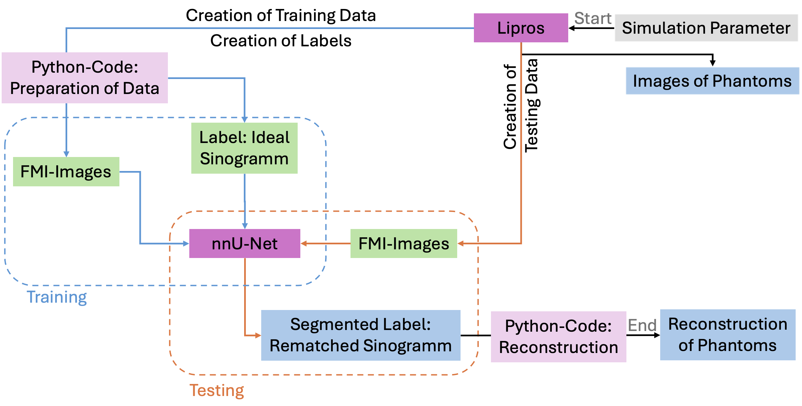

# Enhancing-Fluorescene-Molecular-Tomography-through-Deep-Learning
This repository offers a framework for investigating the effectivity of deep learning, specifically nnU-Net, in enhancing in vivo Fluorescence Molecular Tomography through semantic segmentation as an alternative to resolving the ill-posed inverse problem.

Further details, references and sources can be found in Bachelor_Thesis_SvS.pdf.
